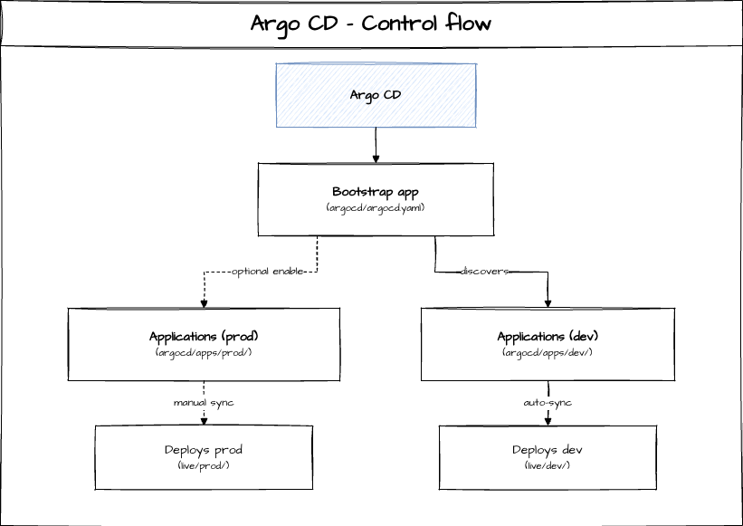

# MyDecisive Collector Mesh GitOps (Monorepo)

This repo is structured so that:
- `catalog/` is the source-of-truth library (globals, solution bundles). Team-specific overrides live under `live/<env>/teams/<team>/`.
- `live/` is the only place Argo CD should sync from (what is actually enabled per environment).

## Key paths
- Global enforced baseline (per env): `argocd/mdai/live/<env>/global`
- Team-specific enablement (per env): `argocd/mdai/live/<env>/teams/<team>`

## Add a new solution
1. Create `argocd/mdai/catalog/solutions/<solution-name>/vN/`
2. Put manifests or Kustomize patches there with a `kustomization.yaml`
3. Reference it from one or more team bundles under `argocd/mdai/live/<env>/teams/<team>/kustomization.yaml`

## Environment enablement (dev-only by default)
Argo CD is configured to sync **dev** applications by default from:
- `argocd/apps/dev/`

Production applications are defined but **not enabled** by default:
- `argocd/apps/prod/`

### Turn prod on
Apply the prod app-of-apps Application:
```sh
kubectl apply -f argocd/argocd-prod.yaml
```


### Prod “safe mode” (manual sync)
Prod Applications are intentionally created without `syncPolicy.automated`.
That means prod will **not** deploy until you manually sync the prod Applications.

Sync in UI, or with CLI:
```sh
argocd app sync mdai-global-config-prod
argocd app sync mdai-team-payments-prod
```

### Optional: enable auto-sync in prod (explicit opt-in)
```sh
kubectl -n argocd patch application mdai-global-config-prod --type merge -p '{"spec":{"syncPolicy":{"automated":{"prune":true,"selfHeal":true}}}}'
kubectl -n argocd patch application mdai-team-payments-prod --type merge -p '{"spec":{"syncPolicy":{"automated":{"prune":true,"selfHeal":true}}}}'
```

### Turn prod off
```sh
kubectl -n argocd delete application mdai-apps-prod
```


## Argo CD control flow


