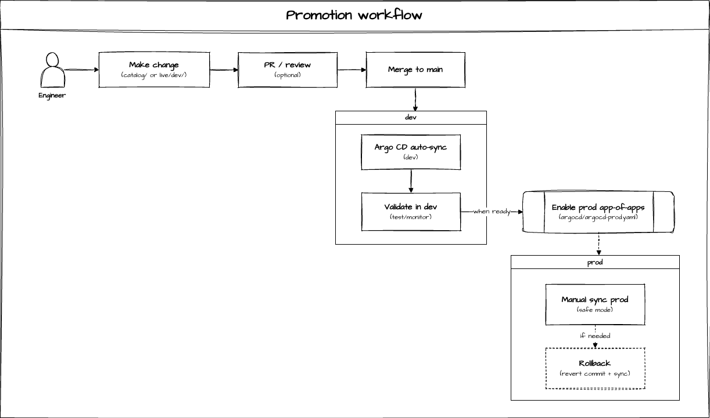

# Production Release Checklist (Safe Mode)

This repo is configured so **dev deploys automatically** and **prod is manual/safe by default**.

- Dev apps live under: `argocd/apps/dev/`
- Prod apps live under: `argocd/apps/prod/`
- Prod is enabled by applying: `argocd/argocd-prod.yaml`

## 0) Before you start
- You have Argo CD access (UI and/or CLI).
- You know which prod Applications you intend to sync (usually `mdai-global-config-prod` first, then team apps).

## 1) Validate the change in Git (no cluster changes yet)
1) Confirm the PR only changes what you expect.
2) Run Kustomize builds locally:
   ```bash
   kustomize build argocd/mdai/live/dev/global > /tmp/dev-global.yaml
   kustomize build argocd/mdai/live/dev/teams/<team> > /tmp/dev-team.yaml

   # If you already maintain prod overlays (recommended), validate them too:
   kustomize build argocd/mdai/live/prod/global > /tmp/prod-global.yaml
   kustomize build argocd/mdai/live/prod/teams/<team> > /tmp/prod-team.yaml
   ```
3) If your workflow uses a tag or release branch, create it now so prod points at an immutable revision.

## 2) Confirm dev is healthy
In Argo CD:
- `mdai` is **Healthy/Synced**
- `mdai-global-config-dev` is **Healthy/Synced**
- Any touched team app (e.g. `mdai-team-payments-dev`) is **Healthy/Synced**

If dev is not green, stop and fix dev first.

## 3) Enable prod (one-time)
If prod is not already enabled in your cluster:
```bash
kubectl apply -f argocd/argocd-prod.yaml
```

Expected result:
- A new Application `mdai-apps-prod` appears.
- It creates prod child apps (e.g. `mdai-global-config-prod`, `mdai-team-*-prod`).
- **They will be OutOfSync** until you manually sync them (this is the safety feature).

## 4) Prod deploy sequence (manual sync)
Recommended order:
1) **Global baseline first**
   - Sync `mdai-global-config-prod`
2) **Team bundles second**
   - Sync the specific team Applications you are releasing (e.g. `mdai-team-payments-prod`)

Why: team bundles typically depend on global contracts/baselines being present.

### How to sync
- In Argo CD UI: open the app → **Sync**
- Or CLI:
  ```bash
  argocd app sync mdai-global-config-prod
  argocd app sync mdai-team-<team>-prod
  ```

## 5) Post-sync verification
For each synced prod Application:
- Status becomes **Synced**
- Health becomes **Healthy**
- No unexpected resources are created/modified outside the app’s scope

If something fails:
- Check the Application events
- Check the failing resource diff
- Confirm you synced the correct order (global before teams)

## 6) Rollback (fast, Git-first)
Prefer Git rollback over kubectl hotfix.

### Roll back a team-only change
1) Revert the enablement/patch under:
   `argocd/mdai/live/prod/teams/<team>/...`
2) Merge
3) Re-sync the smallest scope:
   - `mdai-team-<team>-prod`

### Roll back a global change
1) Revert under:
   `argocd/mdai/live/prod/global/...`
2) Merge
3) Re-sync:
   - `mdai-global-config-prod`

## 7) What NOT to do
- Do not enable `syncPolicy.automated` for prod unless you explicitly want prod to behave like dev.
- Do not apply “quick fixes” with `kubectl apply` that aren’t captured in Git.


## Promotion workflow


